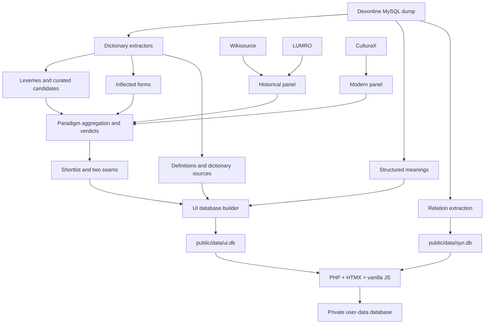

# Voroave neglijate 

Am încercat să găsesc o metodă de a descoperi cuvintele uitate / neglijate ale limbii române, relativ ieșite din uz, evitând însă termenii foarte vechi care și-au pierdut de tot relevanța.

Cuvinte apărute în dicționare, dar care sunt întâlnite rar sau deloc în româna modernă.
**Suveranism lexical**. _Use it or lose it._

&rarr; [voroave.ro](https://voroave.ro/)


Sau cum a zics odată un robot: _A computational linguistics tool to identify "forgotten" Romanian words - terms that exist in official dictionaries but have fallen out of modern usage._

<p style="margin-top: 3rem;">
  <span class="blink-text blink-2">🐵</span> &nbsp;
  <span class="blink-text">☠️</span> &nbsp;
  <span class="blink-text blink-3">🤗</span> &nbsp;
  <span class="blink-text"><b>slove</b> <em>zăuitate</em></span> &emsp;
  <span class="blink-text blink-2"><b>boace</b> <em>oțioase</em></span> &emsp;
  <span class="blink-text blink-3"><b>suveranism</b> <em>lexical</em></span>  
</p>
 
 <style>
 .blink-text
{
    animation:1.7s blinker linear infinite;
    color: blue;
    font-size: 1.25rem;  
}

.blink-text.blink-2 {
    animation:2s blinker2 ease-in-out infinite; color: green;
}
.blink-text.blink-3 {
    animation:1.5s blinker2 ease-in-out infinite; color: yellow; text-shadow: 1px 1px 1px rgba(0,0,0,.4);
}
@keyframes blinker
{  
    0% { opacity: .8; }
    50% { opacity: 0.0; }
    100% { opacity: .7; }
 }
@keyframes blinker2
{  
    10% { opacity: .6; }
    50% { opacity: 0.0; }
    90% { opacity: .8; }
 }
  </style>

----

## What It Does

- Ranks Romanian dictionary words that may merit rediscovery
- Compares the dexonline dictionary collection against selected corpus evidence
- Identifies linguistic "dark matter" - words that exist in dictionaries but have fallen out of active use
- Produces curated lists with rarity scores and linguistic metadata


<!--  -->

---

Vezi și: [initial specs](docs/oțios-init-specs.docx.md) 


## Current workflow

Voroave ranks Romanian dictionary words that may merit rediscovery.
Its verdicts describe evidence in selected corpora, not proven extinction or speaker recognition.
Dexonline is a community dictionary collection, not a single official dictionary.

Start with [scripts and setup](docs/scripts-guide.md).
For delegated fixes, use [the audit handoff](docs/fixes/README.md).
Task status lives in [BACKLOG.md](docs/BACKLOG.md); [activity history](docs/activity-history.md) records completed work.
Read [AGENTS.md](AGENTS.md) before changes. CLAUDE.md carries the same project guidance.

## Architecture



CoRoLa and subtitles are reference datasets, excluded from the current production panels.
Both frequency-screen scripts are standalone; neither feeds `make_shortlist.py` or `ui.db`.
The synonym aid is implemented. Its live query outage found on 2026-10-05 is tracked in F01.

## Setup and verification

Use PHP with PDO SQLite and mbstring. Use a repository-local Python virtual environment.
`requirements.txt` currently includes an optional editable sibling dependency, `../gov2/wrodfreq`.
It is not a self-contained or pinned installation contract; see F07 for the planned repair.
Generated data and the source dump must be obtained/built separately.

```bash
python3 -m venv .venv
source .venv/bin/activate
# Requires the sibling checkout while its editable line remains in requirements.txt:
pip install -r requirements.txt
python -m pytest tests -q
php -S 127.0.0.1:8777 -t public tools/dev-router.php
```

API/browser tests require isolated writable storage. Never use the existing `private/app.db` or production for write tests.
There is no strict all-suite runner yet. JS DOM/browser dependencies are currently undeclared.
See [F07](docs/fixes/F07-test-harness.md) for the acceptance contract.

## Data contracts and evidence

The historical panel totals about 19.4M tokens: Wikisource 14.3M and LUMRO 5.1M.
The modern panel is CulturaX, about 17.0B tokens. These are the audited build's input totals.
Different sizes create different sampling uncertainty; normalized frequencies still share the same units.
The current pipeline uses paradigm-level occurrence gates, not the old shared ppm absence gate.
Modern thresholds rescale with the modern panel size through `scaled_modern_thresholds()`.

| Verdict | Current validator condition |
|---|---|
| `extinct` | Historical occurrences ≥3, historical document evidence ≥2, modern occurrences =0 |
| `historical_only` | Historical evidence passes those floors; modern occurrences >0 and below the scaled rare threshold |
| `declining` | Historical evidence passes; modern occurrences reach the scaled rare threshold but remain below the alive threshold |
| `absent` | Historical evidence fails; modern occurrences remain below the alive threshold |
| `alive` / `emerging` | Modern occurrences reach the alive threshold; excluded from the shortlist |

Baseline rare/alive thresholds are 500/2,000 at 16,969,999,321 modern tokens.
`emerging` versus `alive` additionally uses rank shift. The four shortlisted verdicts do not use rank shift as their gate.
`absent` can include some corpus occurrences. It means insufficient historical footing, not “the most forgotten.”
Occurrence and document values are estimates after ambiguous forms are split.
Within a corpus, document evidence is a maximum over contributing forms; across panels it is summed.
LUMRO's unit is distinct authors; Wikisource's unit is pages.

`Lexeme.frequency` is treated as lexicographic prominence, not measured usage frequency.
That interpretation is empirical; do not turn it into an established definition of dexonline's field.
Zero is treated as missing data. Existing rarity-bin names are legacy metadata, not calibrated probabilities.
Wordfreq's zero means no useful estimate at this vocabulary range; it does not prove absence.

The quality score combines historical evidence, modern rarity, dictionary prominence/coverage,
current dictionary presence, and definition availability. Its hand-set weights are not independently evaluated.
`relevant` and `curiosity` are a partition. Class flags remain separate from the score.
The default view filters classes and uses editorial demotion plus a damped community-vote blend.
Curator choices are reviewable in `data/editorial.tsv`; community marks live in the private database.

Snapshot of local `public/data/ui.db`, checked 2026-10-05 (file dated 2026-08-18):

| Measurement | Count |
|---|---:|
| Words | 18,270 |
| Relevant seam | 3,499 |
| Curiosity seam | 14,771 |
| Words with structured senses | 10,798 |
| Words without a flat definition | 1,126 |
| Words with nonzero Romanian wordfreq Zipf | 38 |

These are local artifact counts, not a guarantee that the deployed artifact is identical.
Structured senses can provide text where the flat definition is missing.
Default-view counts change with filtering; do not copy them into undated docs.

## Durable artifacts

- `data/word_ids.tsv`: append-only permanent IDs behind compact `?w=` shares.
- `data/editorial.tsv`: curator picks/demotions, exported from an explicitly selected account.
- `data/sitemap_words.tsv`: tracked input to generated word-page sitemap.
- `public/data/ui.db` and `syn.db`: generated read-only dictionary artifacts.
- `private/app.db`: writable annotations, lists, devices, and game state; never upload it over an existing deployment.
- `private/secret.key`: signing key; preserve it with configuration and user-data backups.

Only `public/` is deployed. Keep private storage outside the web root.
Database rebuilds currently remove the last artifact first; [F08](docs/fixes/F08-atomic-build.md) specifies atomic replacement.
A snapshot script exists; cron, off-machine backup, and restore readiness still need verification.

## Research and historical notes

- [Corpus expansion and measured exclusions](docs/corpus-expansion-plan.md)
- [Structured senses](docs/senses-plan.md)
- [Synonym implementation specifications](docs/sinonime/README.md)
- [Conceptual roadmap](docs/conceptual-roadmap.md): historical critique with current-status notes
- [Publication assessment](docs/publication-assessment.md): dated assessment, not an implemented evaluation
- [F09 evaluation brief](docs/fixes/F09-evaluation.md): next bounded research deliverable
- [Archived wordfreq recipe](docs/archive-obsolete/wordfreq-recipe.md)
- [Archived script guide](docs/archive-obsolete/scripts-guide.md)

Current priorities are reliability and independent evaluation before feature expansion.
Do not treat old plans as current commands or published outcome claims.
